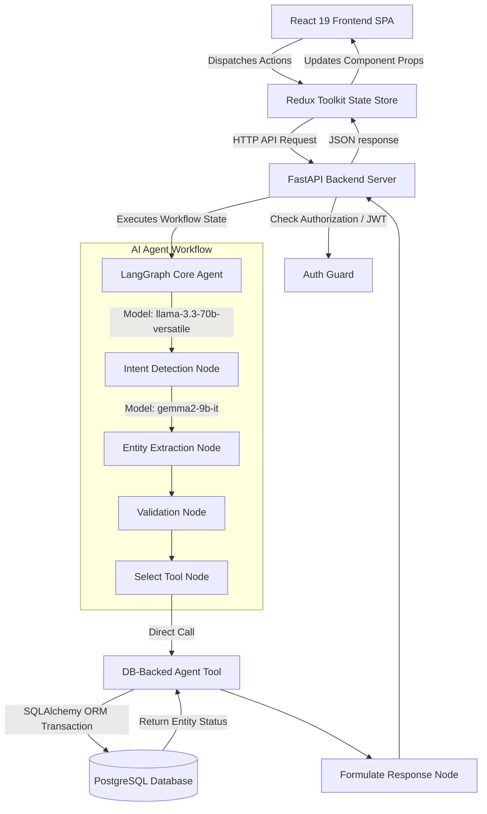

# Application Architecture Diagram & Design

This document details the architectural layout and transactional flows of the AI-First CRM HCP Module.

## System Topology & Data Flow

## Description of Architectural Layers

1.  **Frontend (React 19 + Vite + TailwindCSS)**:
    *   **Vite**: Fast bundling and hot module reloading.
    *   **TailwindCSS**: Utilitarian, class-based custom styling supporting Dark and Light theme states.
    *   **Redux Toolkit**: Unidirectional data management across user authentication, chats, HCP directories, and follow-ups.

2.  **API Gateway Layer (FastAPI)**:
    *   Implements Dependency Injection for database sessions (`get_db`) and token checking (`get_current_user`).
    *   Secured using OAuth2 Bearer standards with JWT signatures.
    *   Exposes clean REST routes alongside the LangGraph agent `/chat` endpoint.

3.  **Agent Logic Core (LangGraph)**:
    *   Implements a StateGraph with linear nodes executing:
        *   **Intent Classifier**: Classifies conversational logs (logging interactions, updates, searches, histories, follow-ups).
        *   **Entity Extractor**: Parses parameters from the prompt and outputs clean JSON.
        *   **Input Validator**: Flags missing values.
        *   **Tool Executor**: Matches classified intents to transactional python scripts.
        *   **Response Formulator**: Formulates final markdown responses.

4.  **Database Storage (PostgreSQL + SQLAlchemy)**:
    *   Fully indexed relational tables (`users`, `hcps`, `products`, `interactions`, `followups`, `chat_history`, `activity_logs`).
    *   Cascading foreign constraints ensuring transactional safety.
